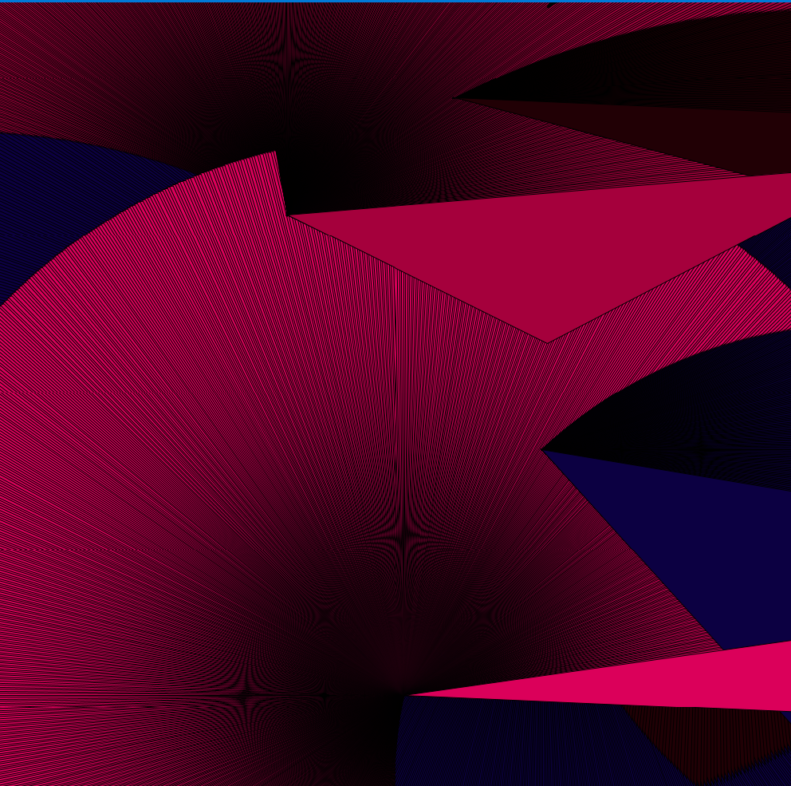

# Sept22 Homework Documentation

### The process

Before I started my work on this project, I was extremely tempted to re-use my last homework code since I have learned that what I did on the previous homework is a generative artwork. I could have just made the circle and the line in the previous code separate Objects and be done with it. However, that seemed a bit uninspired to me, and I really wanted to get my hands on the new functions I've learned from the Homework Readings (`rotate()`, `scale()`, and `translate()`). Therefore, I reset my whole canvas.

First, I created the classes from which I could construct the shapes to appear on the canvas. I have created the `CustomBox` and `CustomTriangle` classes, which would be responsible for portraying

### Difficulties I have faced

Aside from deciding if I should rewrite my old code (easier) or start from scratch (more creative), I kept getting a `NullPointerException` on my Processing code, which frustrated me a lot. But I was able to debug my code after Googling around a lot. The page that helped me out a lot in debugging the code has been referenced below. I was not initializing my object array when declaring them. Small issue, but very hard to identify. Perhaps the smaller the issue is, the harder it is to spot it from the code. 

### Interesting Observations I have made

### References
- Homework Reading 1 ([link](https://www.youtube.com/watch?v=o9sgjuh-CBM)).
- Null Pointer Exception Solution ([link](https://forum.processing.org/two/discussion/8071/why-do-i-get-a-nullpointerexception)).

### The screenshot of the program 

