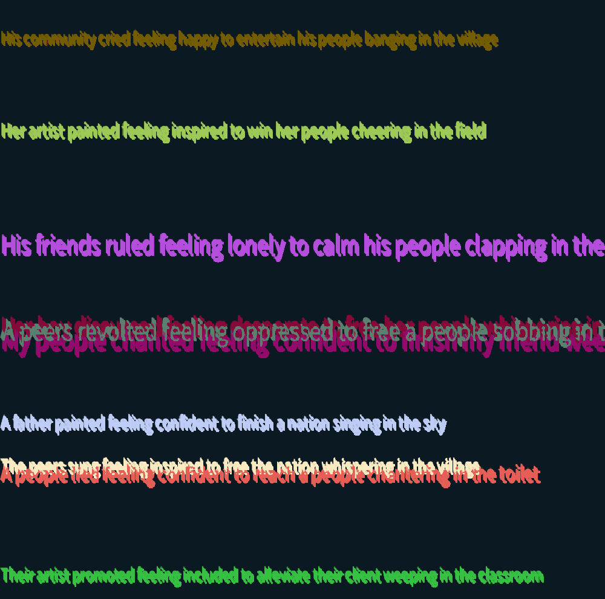

# Sept27 Homework Documentation

### The process

Because this homework has been quite the shift from our regular homeworks for me due to the addition of data visualization and the specifics of it, I did not know where to begin.  Because on the previous homeworks, I would at least have a rough image (not an idea) of what I wanted to do even though the project would turn out to become something entirely different. Furthermore, on the previous homeworks, I could just start coding without thinking too much and just play with the elements a lot and appreciate the final result. This time, however, I believed I was forced to think about what kind of visualization it should be and what kind of data I should fetch from the web.  

As I was looking for a good database that could give me a valid data from which I could build something from, I totally changed my mind. I realized that I wanted to generate and display poetry through code. But how can I do that?

First I needed a CSV file to load words from, so I created a CSV file, each row filled with words in sequence from each category (person = 0, action = 1, feeling = 2,  intention = 3, recipient = 4, sound = 5, and environment = 6). Then I chose a random row from the CSV file and accessed the word using the desired index. Each of these word strings was concatenated to generate a poem. 

The poems were generated through a for loop and held in an array. As my classmate Injoo Kang's previous assignment where she displayed words of random size and random color at random positions had particularly inspired me, I took a look at her repository (referenced below) to see how she did it. Not only was she displaying the words at random position, she was moving them as well. I took inspiration from her methods that display the texts of random size and color and used it in my code. I also added a method that would "move" the text (but not really move them, just to make each texts a bit blurry). 

The final product was certainly more interesting than I'd hoped. Not only some of the poems were surprisingly meaningful coming from randomness, they looked good on the canvas too.

### Difficulties I have faced

Aside from deciding what to do for this assignment and trying to find a good database, I also struggled a bit in coming up with a "formula" for my computer generated poems. But I was able to classify the words to form a poem at last by analyzing what sorts of words poems should best have.

### Interesting Observations I have made

The fact that finding a quality database (that would give valid output files) could be the hardest part in data visualization certainly seemed interesting to me.

### References

- Classmate Injoo Kang's [github repository](https://github.com/injoo626/IntroToIM/tree/main/Sept21).

### The screenshot of the program 

