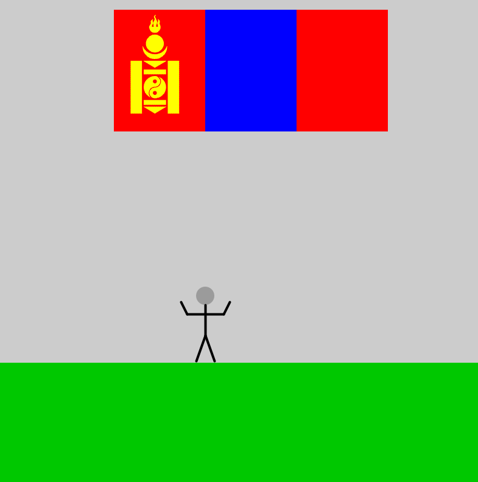

# Sept7 homework documentation

### Difficulties I have Faced
 - When drawing the flag, I was initially confused on how to divide one big rectangle into three identical rectangles. Then, I realized that I could make three identical rectangles placed together to form the flag. 
 - I did not know how to make the symbol on Mongolia's flag. Then I saw that I could play with images on Processing from here.

### Interesting Observations I have Made

### Screenshot of the self-portrait

 
